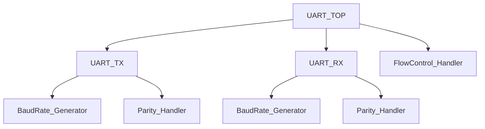

# UART Design with Parity and Flow Control

[](LICENSE)

A configurable UART (Universal Asynchronous Receiver/Transmitter) supporting parity checking and RTS/CTS flow control, verified using a UVM testbench.

## Overview
This project implements a UART module with the following features:
- Configurable baud rate (9600, 115200, etc.)
- Parity generation/checking (even, odd, none)
- RTS/CTS hardware flow control
- UVM-based verification environment

## Architecture



## Project Structure
```
uart_project/
├── rtl/
│   ├── uart_top.sv            // Top-level UART module
│   ├── uart_tx.sv             // Transmitter (parallel-to-serial)
│   ├── uart_rx.sv             // Receiver (serial-to-parallel)
│   ├── baudrate_gen.sv        // Baud rate clock generator
│   ├── parity_handler.sv      // Parity bit generation/checking
│   └── flow_control.sv        // RTS/CTS handshake logic
├── tb/
│   ├── uvm_tb/                // UVM testbench
│   │   ├── uart_agent.sv      // Driver, monitor, sequencer
│   │   ├── uart_seq.sv        // Test sequences
│   │   └── uart_scoreboard.sv // Response checker
│   └── top_tb.sv              // Testbench top module
├── scripts/
│   ├── run_sim.sh             // Simulation script (VCS/ModelSim)
│   └── wave.tcl               // Waveform configuration
├── sim/                       // Simulation logs/waveforms
├── docs/                      // Module-specific READMEs (future)
└── fpga/                      // FPGA synthesis files (optional)
```

## Module Descriptions

### 1. `uart_top.sv`
**Top-Level Interface**  
- Instantiates `uart_tx`, `uart_rx`, and shared modules
- Parameters: `DATA_BITS`, `BAUD_RATE`, `PARITY_TYPE`
- Interfaces:  
  ```systemverilog
  module uart_top (
    input  logic clk, rst_n,
    // UART signals
    input  logic rx_in,        // Serial input
    output logic tx_out,       // Serial output
    // Flow control
    output logic rts,          // Request to Send
    input  logic cts           // Clear to Send
  );
  ```

### 2. `uart_tx.sv`
**Transmitter Logic**  
- Converts parallel data to serial output
- State Machine:  
  ```mermaid
  stateDiagram-v2
    Idle --> Start : Data valid
    Start --> Data : Start bit sent
    Data --> Parity : All bits shifted
    Parity --> Stop : Parity bit sent
    Stop --> Idle : Stop bit sent
  ```
- Key signals: `tx_busy`, `tx_data_valid`

### 3. `uart_rx.sv`
**Receiver Logic**  
- Samples serial input using oversampling (16x baud clock)
- Error detection: framing, parity
- Key signal: `rx_data_ready`

### 4. `parity_handler.sv`
**Parity Generation/Checking**  
- Configurable even/odd parity
- Combinational logic for parity bit calculation

### 5. `flow_control.sv`
**RTS/CTS Handshake**  
- Asserts `rts` when FIFO is near full
- Halts transmission if `cts` is deasserted

## Verification (UVM Testbench)
- **Test Cases**: Baud rate variations, parity errors, flow control scenarios
- **Coverage**: Baud rate, parity type, FIFO fill levels
- **Regression**: Run with `make regression`

## Getting Started
1. Clone repository:
   ```bash
   git clone https://github.com/<your_username>/uart_project.git
   ```
2. Run simulation:
   ```bash
   cd scripts && ./run_sim.sh
   ```
3. View waveforms:
   ```bash
   gtkwave sim/uart_waves.vcd
   ```

## FPGA Deployment (Optional)
Synthesize with:
```tcl
read_verilog -sv rtl/*.sv
synth_design -top uart_top -part xc7a35ticsg324-1L
```

---
**Contributing**: See [Module READMEs](./docs/) for implementation details.  
**License**: MIT
